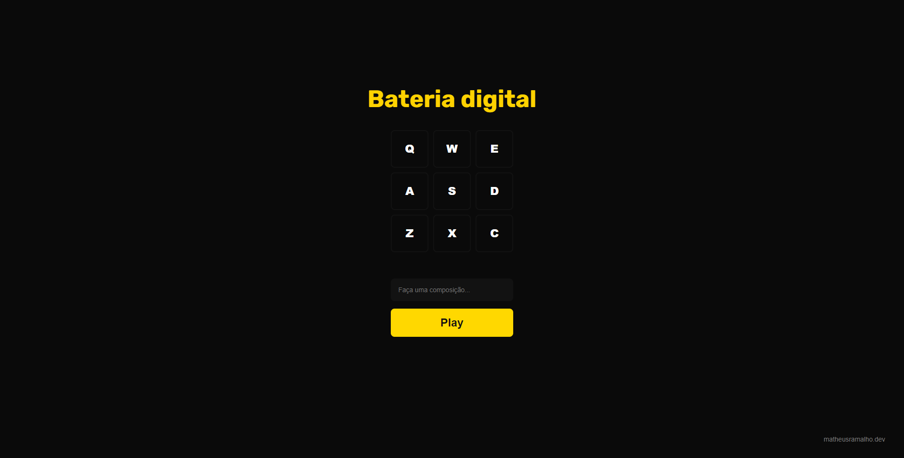

## DRUMS APP
<br>

<p align="center">
    
</p>
<br>

## 🚧 Description

Projeto de uma bateria online, feita com html, sass e javaScript.
Toque suas músicas preferidas, crie suas músicas como um grande baterista

<br>

## 🚀 Technologies

This project was developed using the following technologies:

- [HTML / CSS / JS](https://developer.mozilla.org/)
- [SASS](https://sass-lang.com/)

Run this command to install the dependencies.

```
sass src/css/app.scss assets/css/app.css --style compressed --no-source-map
sass --watch src/css/app.scss:assets/css/app.css --style compressed --no-source-map
```

<br>

## 🔖 Layout

You can view the project through the links below:

- [Live Preview](https://drumsjs-mat.vercel.app/)

<br>

## 📝 License

This project is licensed under the MIT License. See the [LICENSE](LICENSE) file for details.

<br>

---

Made with 💜 by [matheuramalho](https://www.matheusramalho.dev) ✌🏻
